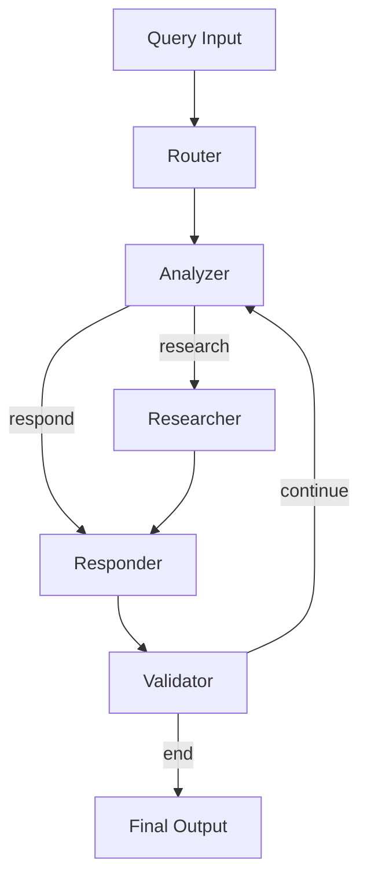

# Iterative AI Workflow Agent using LangGraph and Gemini

This project implements an intelligent, multi-step query-handling agent using **LangGraph** and **Gemini 1.5 Flash** via **LangChain**. It processes queries through a series of purpose-driven stages including routing, analysis, research, response generation, and validation. The agent uses an iterative feedback loop to refine its responses until they meet a satisfactory threshold or reach a maximum iteration count.

---

## 🚀 Features

- Graph-based AI agent with modular, reusable nodes
- Integration with Google Gemini 1.5 Flash (via LangChain)
- Iterative feedback loop for refining responses
- Custom state management across workflow nodes
- Configurable max iterations and validation logic

---

## 🧠 Architecture Overview

### 🧩 Node-Based Workflow (LangGraph)

The agent is modeled as a **state machine** using LangGraph. Each node performs a specific function:

## 🧩 Nodes Description

| Node         | Function                                                                 |
|--------------|--------------------------------------------------------------------------|
| **Router**   | Categorizes the query and initiates the processing flow                 |
| **Analyzer** | Determines whether to respond directly or gather more information       |
| **Researcher** | Gathers relevant background or factual data if needed                 |
| **Responder** | Generates a natural language response using Gemini                     |
| **Validator** | Evaluates the response and decides whether to refine or finish         |

---

## 🧑‍💻 Technologies Used

- LangGraph
- LangChain
- Google Gemini 1.5 Flash
- Python 3.10+
- dotenv
- dataclasses, typing, json

---
## ⚙️ How It Works

- User provides a query.
- The Router directs it to the Analyzer.
- The Analyzer decides whether research is needed.
- If needed, the Researcher gathers info before passing it to the Responder.
- The Responder crafts a response using Gemini.
- The Validator checks if the response is complete.
- If incomplete, the loop continues.
- If validated, the process ends.
